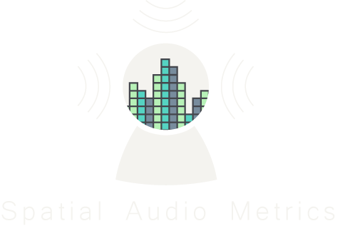
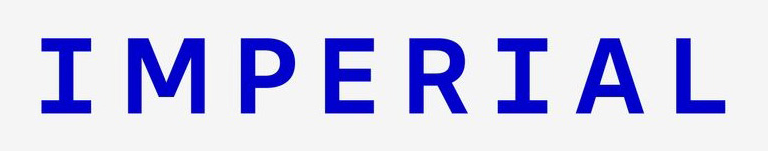

# Spatial Audio Metrics

 
Spatial Audio Metrics (SAM) is a toolbox in Python that allows the visualisation and comparison of HRTFs and analysis of spatial audio experiments with new features being continually added. It was made in order to provide open-source tools that allow easier analysis of data within the spatial audio domain.

# Documentation
Detailed documentation of the Spatial Audio Metrics can be found here: <https://spatial-audio-metrics.readthedocs.io>

# Installation
You can install the package using pip:
'pip install spatialaudiometrics'

# Acknowledgements
If you use this toolbox in your own work then please cite this paper: 

The Extended SONICOM HRTF Dataset and Spatial Audio Metrics Toolbox (2025)
Katarina C. Poole, Julie Meyer, Vincent Martin, Rapolas Daugintis, Nils Marggraf-Turley, Jack Webb, Ludovic Pirard, Nicola La Magna, Oliver Turvey, Lorenzo Picinali
Forum Acusticum 2025
https://doi.org/10.48550/arXiv.2507.05053

This work was created whilst part of of the Audio Experience Design Team (https://www.axdesign.co.uk/) at Imperial College London.

   

The SONICOM project has received funding from the European Union’s Horizon 2020 research and innovation programme under grant agreement no.101017743. The sole responsibility for the content of this project lies with the authors. It does not necessarily reflect the opinion of the European Union. The European Commission is not responsible for any use that may be made of the information contained therein.

# License
Copyright (C) 2024  Katarina C. Poole (Audio Experience Design Team at Imperial College London)

This program is free software: you can redistribute it and/or modify
it under the terms of the GNU General Public License as published by
the Free Software Foundation, either version 3 of the License, or
(at your option) any later version.

This program is distributed in the hope that it will be useful,
but WITHOUT ANY WARRANTY; without even the implied warranty of
MERCHANTABILITY or FITNESS FOR A PARTICULAR PURPOSE.  See the
GNU General Public License for more details.

You should have received a copy of the GNU General Public License
along with this program.  If not, see <https://www.gnu.org/licenses/>.
