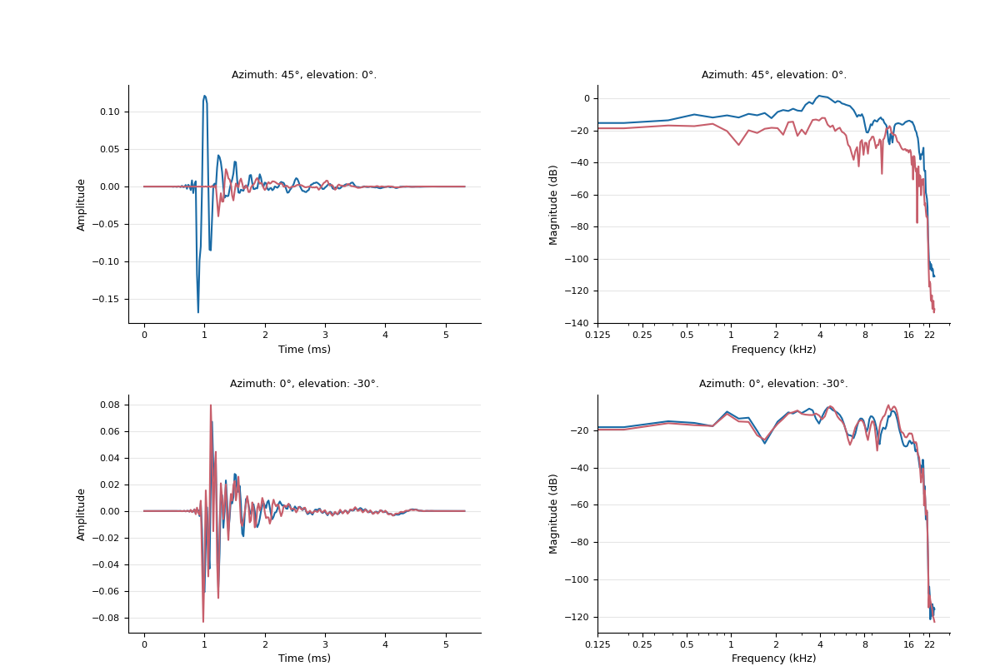

HRTF analysis tutorial
=================================================

This package can be used to visualise HRTFs and assess differences between HRTFs (currently those that are from the same database, i.e. have the same source localisations and IR length).

Loading in HRTFs
----------------------

HRTFs are typically stored as sofa files, so the the module creates an HRTF object by pulling out relevant data from the sofa file when initialising the object. You can load your own sofa file like so:

.. code-block:: python

    from spatialaudiometrics import load_data as ld

    hrtf1 = ld.HRTF(hrtf_original)
    hrtf2 = ld.HRTF(hrtf_upsampled)

You can load HRTFs directly from the SONICOM dataset (stored online). Here I am loading participant number 'P0107', with the windowed hrir at 48kHz which has the itd in the hrirs.

.. code-block:: python

    hrtf = ld.load_sonicom_sofa('P0107','Windowed',48,no_itd = False)

Visualising HRTFs
-----------------------------------------
The toolbox also comes with functions to visualise the HRTF you just loaded. 
We can visualise the positions in which we have an HRTF list so:

.. code-block:: python

    from spatialaudiometrics import visualisation as vis

    vis.plot_source_locations(hrtf.locs, elevation_palette="mako")

We can plot some basic visualisation like the hrir and hrtf at specific locations

.. code-block:: python

    fig,gs = vis.create_fig()

    axes = fig.add_subplot(gs[1:6,1:6])
    vis.plot_hrir_both_ears(hrtf,45,0,axes)
    axes = fig.add_subplot(gs[1:6,7:12])
    vis.plot_hrtf_both_ears(hrtf,45,0,axes)

    axes = fig.add_subplot(gs[7:12,1:6])
    vis.plot_hrir_both_ears(hrtf,0,-30,axes)
    axes = fig.add_subplot(gs[7:12,7:12])
    vis.plot_hrtf_both_ears(hrtf,0,-30,axes)

    vis.show()

We can visualise the ITDs and ILDs of the HRTF with these functions:

.. code-block:: python

    vis.plot_itd_overview(hrtf)
    vis.plot_ild_overview(hrtf)

Here we can load in an overview of the transfer function of an HRTF at specific locations across elevations.

.. code-block:: python

    vis.plot_tf_overview(hrtf,az = [0,90,180,270])

Calculating HRTF metrics
-----------------------------------------

The function hrtf_metrics allows us to calculate a number of metrics regarding an HRTF
For example we can calculate the ILD and ITD at each location as well as pull out the transfer function (the spectra).

.. code-block:: python

    from spatialaudiometrics import hrtf_metrics as hf

    spectra, freqs, phase   = hf.hrir2hrtf(hrtf1.hrir,hrtf1.fs)
    ild                     = hf.ild_estimator_rms(hrtf1.hrir)
    itd_s,itd_samps,maxiacc = hf.itd_estimator_maxiacce(hrtf1.hrir,hrtf1.fs)

Calculating differences between HRTFs
-----------------------------------------
There are two example sofa files you can load in:

.. code-block:: python

    hrtf1,hrtf2 = ld.load_example_sofa_files()

After loading in the HRTFs, to run any direct comparisons we need to make sure the source locations are matched between them and reorder them if not. This can be done like so:

.. code-block:: python

    hrtf1,hrtf2 = ld.match_hrtf_locations(hrtf1,hrtf2)

Then to calculate differences between the hrtfs we can use the following functions:

.. code-block:: python

    from spatialaudiometrics import hrtf_metrics as hf

    itd_diff = hf.calculate_itd_difference(hrtf1,hrtf2)
    ild_diff = hf.calculate_ild_difference(hrtf1,hrtf2)
    lsd,lsd_mat = hf.calculate_lsd_across_locations(hrtf1.hrir,hrtf2.hrir,hrtf1.fs)

This will give you single values (averaged across source positions and/or frequency).

Visualising differences between HRTFs
-----------------------------------------
We can then visualise these differences using the below functions

.. code-block:: python

    df = hf.generate_table_difference_hrtfs(hrtf1,hrtf2)
    vis.plot_LSD_left_and_right(df)
    vis.plot_ild_itd_difference(df)

