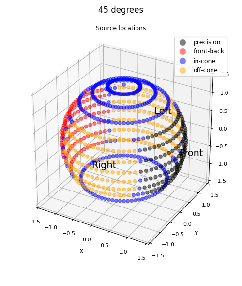
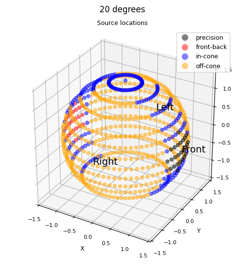
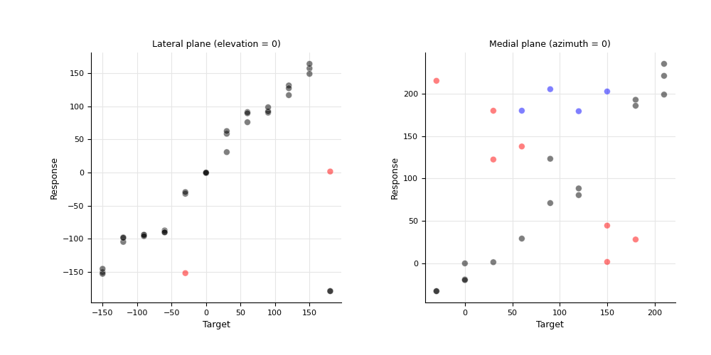
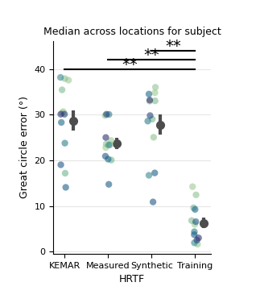

Localisation behaviour analysis tutorial
=================================================

This package can be used to analyse performance in a localisation experiment and visualise the data

Loading in the behavioural data
----------------------------------

The package makes use of Pandas so all data is stored as a data frame. Here we will use some example data but if you want to use your own then it would be best to use pandas to load your data and concatenate it together to create a large dataframe.
The important thing is to make sure you have columns denoting your indepdent variables (i.e. Subject and/or HRTF) as well as response variables specifically called:

- azi_target
- azi_response
- ele_target
- ele_response

These denote the location of the target in the spherical coordinate system and the response of the subject

When we load our data we will also want to run some preprocessing steps that:

- 1. Wraps azimuth/elevation angles between -180 and 180 (negative = counterclockwise/down)
- 2. Adds in the spherical coordinate system (lateral and polar angles)
- 3. Calculate errors and classifys confusions

.. code-block:: python

    from spatialaudiometrics import load_data as ld

    df = ld.load_example_behavioural_data()
    df = ld.preprocess_behavioural_data(df, cone_size_degrees=45)

One thing to note is that in the confusion classification you can adjust the size of the "cone" that classifys the type of confusion. It has a default of 45 degrees but you may want a small cone dependent on your use-case.
Please see an example of how the classification works for a 45 degree cone and 20 degree cone where the target is at azi, ele coordinates: 0,0
You can use the below function to plot your own confusion sphere for real or simulated value at a specified target

.. code-block:: python

    from spatialaudiometrics import visualisation as vis
    
    vis.plot_confusion_sphere(df,azi_target = 0,ele_target = 0)

Visualising the behavioural data
---------------------------------------

We can plot the raw localisation data when restricted to a certain condition and plane coloured by confusion 

.. code-block:: python

    fig,gs  = vis.create_fig(fig_size = (10,5))

    df2     = df.loc[(df.HRTFidx == 2) & (df.ele_target == 0)]
    axes    = fig.add_subplot(gs[1:11,1:6])
    vis.plot_raw_localisation(df2,axes,'azi')
    axes.set_title('Lateral plane (elevation = 0)')

    df2     = df.loc[(df.HRTFidx == 2) & (df.lat_target == 0)]
    axes    = fig.add_subplot(gs[1:11,7:12])
    vis.plot_raw_localisation(df2,axes,'pol')
    axes.set_title('Medial plane (azimuth = 0)')

Calculating and visualising statistics on localisation metrics per subject
-------------------------------------------------------------------------------------

You may want to calculate and visualise the statistics of each metric across subjects

N.B: The example plots from now on wont use the example data loaded before as the research is still ongoing and to create these plots multiple subjects are required.

Here we can use pandas groupby function to get the median for each subject x HRTF, plot this and the errorbars across subjects (mean and s.e.)
We can then run stats (checking for normality) and then running the appropriate pairwise comparisons and plotting this on the graph
The terminal will print out the results from the statistics

.. code-block:: python

    from spatialaudiometrics import statistics as sts

    df2 = df.groupby(['HRTFidx','subject']).median().reset_index()
    sns.stripplot(data=df2, x="HRTFidx", y="great_circle_error", hue = 'subject',size = 6, palette = "crest", alpha = 0.6)
    vis.plot_error_bar(axes,df2,"HRTFidx","great_circle_error","subject")
    axes.set_ylabel('Great circle error (°)')
    axes.set_title('Median across locations for subject')

    # Run stats
    stats       = sts.repeated_measures_anova(df2,'great_circle_error','subject',['HRTFidx'])
    if stats == None:
        stats   = sts.run_friedman_test(df,'great_circle_error','subject',['HRTFidx']) 
    
    # Plot stats
    vis.plot_sig_bars_pairwise(axes,stats[1])

    axes.set_xlabel('HRTF')
    vis.finish_axes(axes)

This was just on a per trial metrics such as great circle error but you can also run the above on per subject metrics (aka % of front back confusions)

To get the per subject metrics use the below function (where the last arguments specify your grouping variables): 

.. code-block:: python

    from spatialaudiometrics import localisation_metrics as lm

    error_df = lm.calculate_localisation_error(df,'subject','HRTFidx')
